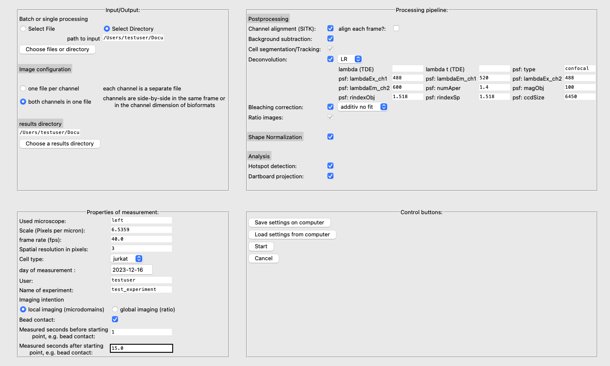
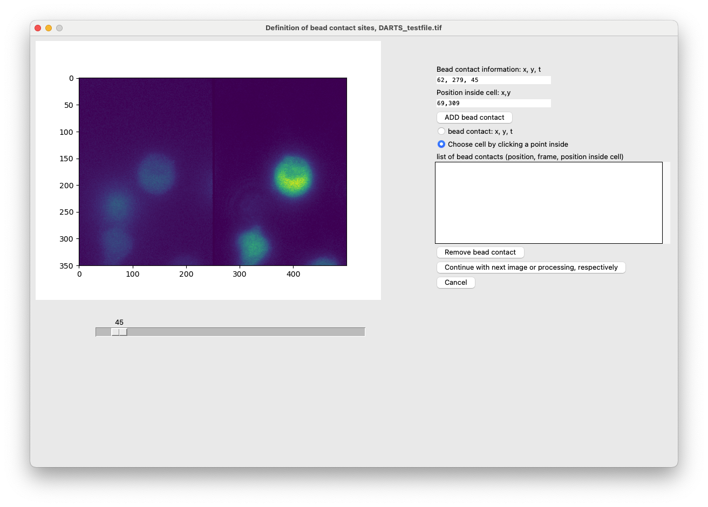

# DARTS
[](https://zenodo.org/doi/10.5281/zenodo.10459242)


## About
**DARTS** is an integrated tool originally designed for the analysis of Ca<sup>2+</sup> microdomains in immune cells (Jurkat T cells, primary murine cells, NK). It is not limited
to these data, but can also be used to analyze other intracellular signals in other cell types. Moreover, the global signal can me measured, too.
For detailed information, see the [Documentation](https://ipmi-icns-uke.github.io/DARTS/).

It combines the following modules:

- Postprocessing
   - channel registration
   - background subtraction
   - cell detection and tracking
   - deconvolution
   - bleaching correction
   - ratio computation 
- Shape Normalization
- Hotspot Detection and Dartboard visualization (based on [2])

Most of these modules can be switched on or off, depending on the individual analysis (see Usage).

## Installation 
We recommend using [anaconda](https://www.anaconda.com/download) to install the necessary packages.

Download and install anaconda and python and either clone the DARTS code with 
``
git clone https://github.com/IPMI-ICNS-UKE/DARTS.git
``

or download the .zip file via the download button. Before continuing, please check the prerequisites on the Installation page in the [Documentation](https://ipmi-icns-uke.github.io/DARTS/General/Installation.html).

Navigate to the folder containing the `DARTS.yml` file and run 

```
conda env create -f DARTS.yml
conda activate DARTS
```

in the command line. 

For more information regarding the installation, see the [Documentation](https://ipmi-icns-uke.github.io/DARTS/)


## Usage
1. DARTS is designed for the analysis of dual-channel fluorescence microscopy. Make sure, that the raw data are suitable (see [Documentation](https://ipmi-icns-uke.github.io/DARTS/))
2. Store raw image files in a source directory. All common microscopy image formats can be opened, e.g. ics- or tif-files. 
3. Define whether it is a local measurement (interested in local hotspots) or just a global measurement (mean ratio over time).
4. Run `python main.py` in the terminal/ shell/ powershell or IDE of your choice.
5. Enter relevant information in the GUI (see [Documentation](https://ipmi-icns-uke.github.io/DARTS/) for more extensive explanation). Then click on start. You can also save the settings to your local machine and access it later.
6. Depending on the analysis mode (local/global, beads/no beads), you might be asked to provide information regarding the starting point (t=0) of the measurement for each file. For local measurements with beads, the starting point is the time of bead contact, for example. All cases are explained in the [Documentation](https://ipmi-icns-uke.github.io/DARTS/).
7. Eventually, after providing all the information, DARTS automatically analyzes the data, putting out multiple data (explained in the Documentation). 



In this case, we chose to analyze the local hotspots in a measurement, where cells were stimulated with stimulatory antibody-coated beads. 
We now have to define the bead contacts, which consist of a position and time point as well as the information about the stimulated cell. 
1. Use the slider, to find the time of contact between a bead and a cell of interest.
2. In the option menu on the right hand side, select "bead contact: x, y, t"
3. Click on the position in the left half of the image, where the contact between the cell and the bead contact is located at.
4. Next, select "Choose cell by clicking a point inside". Click on the cell that is stimulated by this bead, preferably in the middle.
5. Click on "ADD bead contact". 
6. Repeat the steps 1 - 5 for other bead contacts in this file. If you have defined all the bead contacts, go ahead and click on the "Continue"-button.
7. Now, go ahead with the next files. If you have reached the last file, the script will automatically start with the analysis of all files.



There are other cases, such as the hotspot detection without beads or global measurements with/without beads. These cases are explained in the [Documentation](https://ipmi-icns-uke.github.io/DARTS/).

## License
This code runs under the Apache 2.0 license.

## References and Citing
If DARTS is useful for a project that leads to publication, please acknowledge DARTS by citing it.

[1]  Woelk L-M, Kovacevic D, Husseini H, Förster F, Gerlach F, Möckl F, Altfeld M, Guse AH, Diercks B-P and Werner R. DARTS: an open-source Python pipeline for Ca2+ microdomain analysis in live cell imaging data. Front. Immunol. 2024;14:1299435; doi: [https://doi.org/10.3389/fimmu.2023.1299435](https://doi.org/10.3389/fimmu.2023.1299435)

[2] Diercks BP, Werner R, Schetelig D, Wolf IMA, Guse AH. High-Resolution Calcium Imaging Method for Local Calcium Signaling. Methods Mol Biol. 2019;1929:27-39. doi: [https://doi.org/10.1007/978-1-4939-9030-6_3](https://doi.org/10.1007/978-1-4939-9030-6_3)

