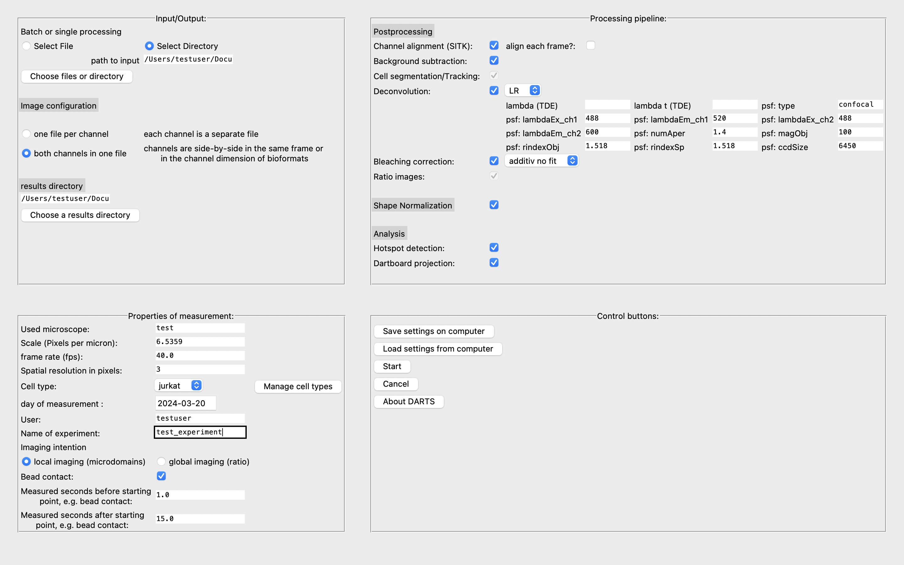
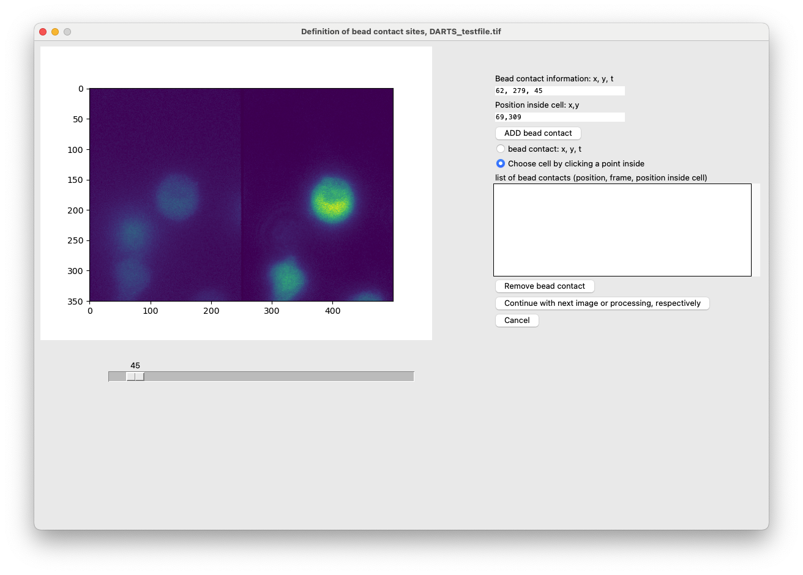

# DARTS
[](https://zenodo.org/doi/10.5281/zenodo.10459242)


## About
**DARTS** is an integrated tool originally designed for the analysis of Ca<sup>2+</sup> microdomains in immune cells (Jurkat T cells, primary murine cells, NK). It is not limited
to these data, but can also be used to analyze other intracellular signals in other cell types. Moreover, the global signal can me measured, too.
For detailed information, see the [Documentation](https://ipmi-icns-uke.github.io/DARTS/).

It combines the following modules:

- Postprocessing
   - channel registration
   - background subtraction
   - cell detection and tracking
   - denoising
   - deconvolution
   - bleaching correction
   - ratio computation 
- Shape Normalization
- Hotspot Detection and Dartboard visualization (based on [2])

Most of these modules can be switched on or off, depending on the individual analysis (see Usage).

## Installation
To install DARTS on your computer, a few steps need to be executed. Ideally, you are using a Mac computer with macOS Catalina (10.15) or higher and Intel processor. These settings have been tested extensively. 

- Install Python 3.10.0, following the instructions on the official website (https://www.python.org/downloads/release/python-3100/)
- Install Anaconda (https://docs.anaconda.com/free/anaconda/install/index.html)
- Install the latest git version via your terminal (see https://git-scm.com/book/en/v2/Getting-Started-Installing-Git)
- In the terminal window, navigate to the folder where you want to save the required code. 
- Type ```git clone https://github.com/IPMI-ICNS-UKE/DARTS.git``` into the terminal window and press enter. The GitHub repository should now be cloned to your local machine. Alternatively, download the .zip file on the github-page.
- In your file explorer, go to the folder "DARTS/src" and delete the (empty) folder 'TDEntropyDeconvolution'
- In the terminal window, navigate to the subfolder "src" inside the DARTS folder
- Type ```git clone https://github.com/IPMI-ICNS-UKE/TDEntropyDeconvolution.git``` to clone this module to your 'src' folder
- In the terminal window run ```chmod +x install_bioformats.sh```
- run ```./install_bioformats.sh```
    
For more information regarding the installation, see the [Documentation](https://ipmi-icns-uke.github.io/DARTS/)

## Update DARTS
How to update DARTS:
1. Navigate to the DARTS folder in the terminal
2. Activate the conda env: “conda activate DARTS”
3. git checkout main
4. git pull origin main

## Usage
0. Make sure that you navigated to the DARTS folder in the terminal. (To skip one folder layer up, use the command 'cd ../')
1. DARTS is designed for the analysis of dual-channel fluorescence microscopy. Make sure, that the raw data are suitable (see [Documentation](https://ipmi-icns-uke.github.io/DARTS/))
2. Store raw image files in a source directory. All common microscopy image formats can be opened, e.g. ics- or tif-files.
3. Choose the analysis mode: local hotspots or global measurements (mean ratio over time), with or without beads.
4. Run `python main.py` in the terminal / shell / PowerShell or IDE of your choice.
5. Configure the run in the GUI (see [Documentation](https://ipmi-icns-uke.github.io/DARTS/)). Most fields are required. You can save settings for reuse.
6. Optional preprocessing: enable the denoising algorithm in the GUI if your data are noisy. This improves hotspot detection in low‑signal or high‑noise recordings.
7. Optional checkpointing:
   - To **save a checkpoint** after preprocessing, enable the checkbox “Save after preprocessing”. DARTS will store a reusable checkpoint in `results/<measurement>/checkpoints/pre_start`.
   - To **resume from a checkpoint**, choose “Select Checkpoint” as the input mode and pick a checkpoint folder (or the measurement folder). DARTS will skip preprocessing and continue from the saved data.
8. If you selected a **bead** workflow, you will be prompted to define bead contacts (x, y, t) as before.  
   If you selected **no‑bead** workflow, use the no‑bead contact GUI to define the stimulation start time (t=0) and the stimulated cell(s) without bead markers.
9. After inputs are provided, DARTS runs the analysis automatically and exports the results (see Documentation for output details).




**Bead contact workflow**
1. Use the slider to find the bead‑cell contact time.
2. Select “bead contact: x, y, t”.
3. Click the contact position in the left image panel.
4. Select “Choose cell by clicking a point inside” and click the stimulated cell.
5. Click “ADD bead contact”.
6. Repeat for other bead contacts and continue.



**No‑bead workflow**
1. Use the no‑bead contact GUI to set the stimulation start (t=0).
2. Select the stimulated cell(s) using the provided selection tool.
3. Continue to start analysis.


Information: For each file, there might be several bead contacts. In order to save time, the time series will be cropped, so that the frames after the last starting point (e.g. bead contact at 600) + the measurement interval (e.g. 600 frames interval, so 1200 frames cutoff) are deleted as they are not needed.

There are other cases, such as the hotspot detection without beads or global measurements with/without beads. These cases are explained in the [Documentation](https://ipmi-icns-uke.github.io/DARTS/).


## License
This code runs under the Apache 2.0 license.


## References and Citing
If DARTS is useful for a project that leads to publication, please acknowledge DARTS by citing it.

[1]  Woelk L-M, Kovacevic D, Husseini H, Förster F, Gerlach F, Möckl F, Altfeld M, Guse AH, Diercks B-P and Werner R. DARTS: an open-source Python pipeline for Ca2+ microdomain analysis in live cell imaging data. Front. Immunol. 2024;14:1299435; doi: [https://doi.org/10.3389/fimmu.2023.1299435](https://doi.org/10.3389/fimmu.2023.1299435)

[2] Diercks BP, Werner R, Schetelig D, Wolf IMA, Guse AH. High-Resolution Calcium Imaging Method for Local Calcium Signaling. Methods Mol Biol. 2019;1929:27-39. doi: [https://doi.org/10.1007/978-1-4939-9030-6_3](https://doi.org/10.1007/978-1-4939-9030-6_3)

