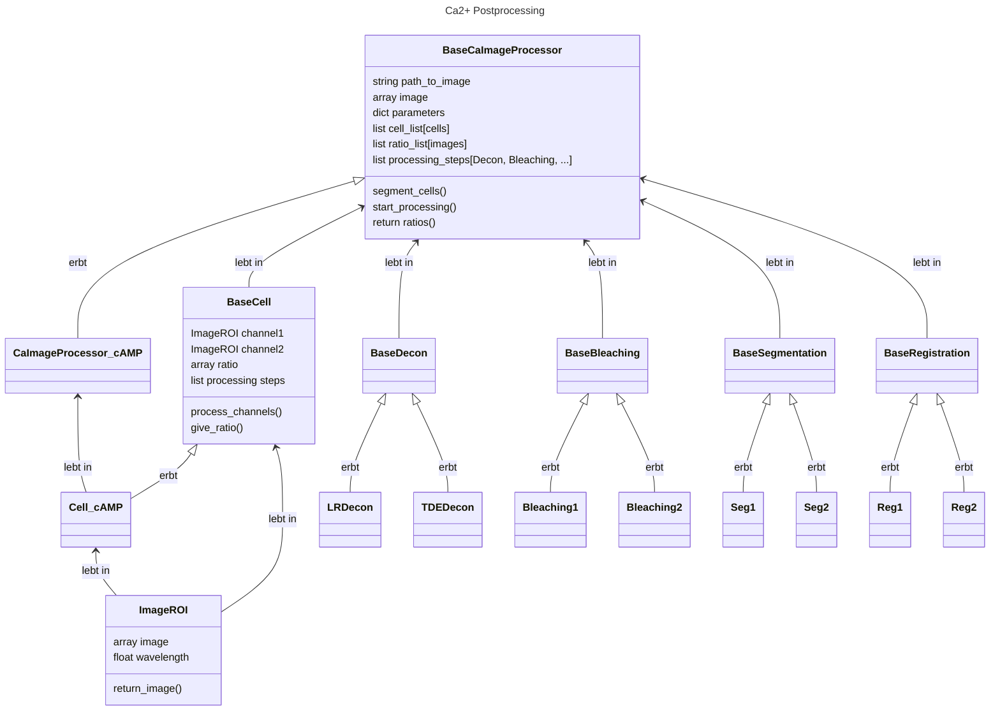

```mermaid
---
title: Ca2+ Postprocessing
---
classDiagram
    
    class BaseCaImageProcessor{
    string path_to_image
    array image
    dict parameters
    list cell_list[cells]
    list ratio_list[images]
    list processing_steps[Decon, Bleaching, ...]
    segment_cells()
    start_processing()
    return ratios()
    }
    
    
    class ImageROI{
    array image
    float wavelength
		return_image()
    }
   
    
    class BaseCell{
    ImageROI channel1
    ImageROI channel2
    array ratio
    list processing steps
    process_channels()
    give_ratio()
    }
    
    BaseCell <|-- Cell_cAMP :erbt
    
    class CaImageProcessor_cAMP{
		
		}
    
    BaseCaImageProcessor <|-- CaImageProcessor_cAMP :erbt
    
    class BaseDecon{
    
    }
    class LRDecon{
    
    }
    class TDEDecon{
    
    }
    BaseDecon <|-- LRDecon :erbt
    BaseDecon <|-- TDEDecon :erbt
    
    BaseBleaching <|-- Bleaching1 :erbt
    BaseBleaching <|-- Bleaching2 :erbt
    
    BaseCell <-- ImageROI: lebt in
    BaseCaImageProcessor <-- BaseCell: lebt in
    BaseCaImageProcessor <-- BaseDecon: lebt in
    BaseCaImageProcessor <-- BaseBleaching: lebt in
    CaImageProcessor_cAMP <-- Cell_cAMP: lebt in
    Cell_cAMP <-- ImageROI: lebt in
    
    BaseSegmentation <|-- Seg1 :erbt
    BaseSegmentation <|-- Seg2 :erbt
    BaseRegistration <|-- Reg1 :erbt
    BaseRegistration <|-- Reg2 :erbt
    BaseCaImageProcessor <-- BaseSegmentation: lebt in
    BaseCaImageProcessor <-- BaseRegistration: lebt in
    
```