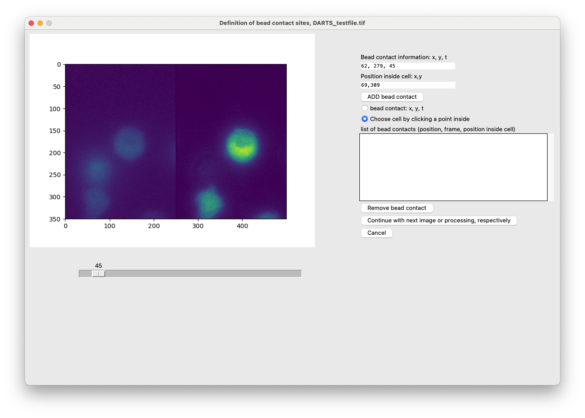

# Usage

## Starting the script
After installing the necessary packages, activate the environment

``
conda activate DARTS
``

and then run

```
python main.py
```

Depending on the python versions you have installed, it might be `python3 main.py`.

## First GUI: Initial information
This initiates the first GUI, prompting for general information. 

### Input/Output 
In this section, you are asked to provide information about the source and results directory as well as the image configuration in the files. If you want to analyze a single file, choose "Select File". Else, click on "Select directory" to provide a directory with raw image data.
If there are always two image channels in one image file, choose "both channels in one file". Else, if there is only one file per channel, click on the corresponding button. 
Finally, you have to define a results directory where you will find all the results of the analysis.

### Properties of measurement 
In this section, you should provide relevant information for the analysis. Some of them are crucial for a functional analysis. 
- Used microscope: You can describe the microscope used for the data acquisition.
- Scale (Pixels per micron): Important for calculating the actual size of the hotspots, for example. In our case, 6.5359 was the default value.
- frame rate (fps): How many frames were measured per second? A crucial parameter for the analysis.
- spatial resolution in pixels: optional 
- cell type: so far, you can choose between Jurkat T cells, primary T cells and NK cells, as their calibration data was incorporated into the script.
- day of measurement; User; Name of experiment: further meta data
- imaging intention: either local imaging for hotspot detection or global imaging for the mean ratio value. An important setting.
- Bead contact: Activate the check box, if you used beads to stimulate the cells. Otherwise, uncheck it (e.g., soluble compounds).
- Measured seconds before starting point: How many seconds should be measured before the later determined starting point? For example, 1 second or 60 seconds. 
- Measured seconds after starting point: How many seconds should be measured after the later determined starting point? For example 15 seconds or 180 seconds.


### Processing pipeline 
In this section, you can assemble your individual processing pipeline. 
#### Postprocessing
Tick or untick the checkboxes to determine which modules should be incorporated into the analysis. In the deconvolution part, you can choose 
between the Lucy-Richardson deconvolution and the Time-Dependent Image Restoration algorithm by Woelk et al. (2021). The parameters have been 
determined experimentally, see the default values.

#### Shape normalization
If you want to normalize the cell shapes (e.g. polymorphic Jurkat T cells), tick the check box. This enables to do the dartboard projection, if the hotspot detection is incorporated, too.

#### Analysis
Tick the hotspot detection check box, if you want to analyze localized hotspots in the images. 

Tick the dartboard projection check box, if dartboard data should be generated. 

#### Dependencies 
Not all check boxes are activated all the time. For example, the dartboard projection requires (1) a shape normalization, (2) bead contacts and (3) a previous hotspot detection. 

### Control buttons 
Finally, after providing all the necessary information, you can save time in the future by saving your settings onto your local machine. You can then load these settings from your computer. 

To start the analysis, you need to click on the Start button. To abort, the Cancel button. 

#### images


An example for a source directory: 


Example image: 


## Test file 
You can try out the script by yourself using the test file that was uploaded to the DARTS-Repo. You can find the file in the following folder: https://github.com/IPMI-ICNS-UKE/DARTS/tree/main/DARTS_test_file. 

The bottom cell has a bead contact at approximately frame 45: 


## analysis scenarios 
### hotspot detection, with bead contacts
After clicking on "Start", there will appear a GUI for each image file, so that the bead contacts can be defined. A bead contact is defined as the contact of a (stimulatory) with the cells of interest. Internally, it consists of (1) the bead contact time, e.g. frame 300 and (2) the bead contact position relative to the center of the cell, e.g. 1 o'clock or 12 o'clock. In order to define bead contacts, the user needs to enter information regarding each bead contact manually. Use the following procedure to define bead contacts: 

In this case, we chose to analyze the local hotspots in a measurement, where cells were stimulated with stimulatory antibody-coated beads. 
We now have to define the bead contacts, which consist of a position and time point as well as the information about the stimulated cell. 
1. Use the slider, to find the time of contact between a bead and a cell of interest.
2. In the option menu on the right hand side, select "bead contact: x, y, t"
3. Click on the position in the left half of the image, where the contact between the cell and the bead contact is located at.
4. Next, select "Choose cell by clicking a point inside". Click on the cell that is stimulated by this bead, preferably in the middle.
5. Click on "ADD bead contact". 
6. Repeat the steps 1 - 5 for other bead contacts in this file. If you have defined all the bead contacts, go ahead and click on the "Continue"-button.
7. Now, go ahead with the next files. If you have reached the last file, the script will automatically start with the analysis of all files.



### hotspot detection, without beads 
In this case, no further manual user input is required, as the starting points for the cells are determined automatically. 

### global imaging, with bead contacts
If you want to analyze global data with bead contacts, then simple follow the steps from the upper section "hotspot detection, with bead contacts".

### global imaging, without beads
Finally, in the case of global imaging without bead contacts, you simply have to provide the time of addition of the soluble compound to the cells in the textbox and then click on the continue button as in the case of bead contacts. 

## Output of running the script 
After the manual user input, the script processes the image files by itself (postprocessing, shape normalization, analysis). Depending on the size of the input data, this can take up to 
hours to complete. 

The output of the script consists of various files:
- if beads were used, information about the defined bead contacts (Bead_contact_information.txt)
- normal (not shape normalized) ratio image files for all detected cells
- if the shape normalization was selected, also the shape normalized ratio images are saved in the results folder. 
- if you chose the analysis of local signals, you will find Excel sheets with all the detected hotspots. Based on the measurement of local hotspots (e.g. Calcium microdomain detection), you will find information regarding the number of responding cells (percentage of cells, that have at least one Calcium microdomain after the bead contact) and the mean amplitude of the responding cells (mean amplitude of the calcium signals in the responding cells). Otherwise, the global data will be saved for each cell. You can also generate both types of data (local measurement + global data).
- if the dartboard projection was selected, you will find Excel sheets with the dartboard data based on the hotspot detection. To create dartboards, read the Analysis->Dartboard section of the Documentation.
- 

Example for results (local imaging, bead contacts):


