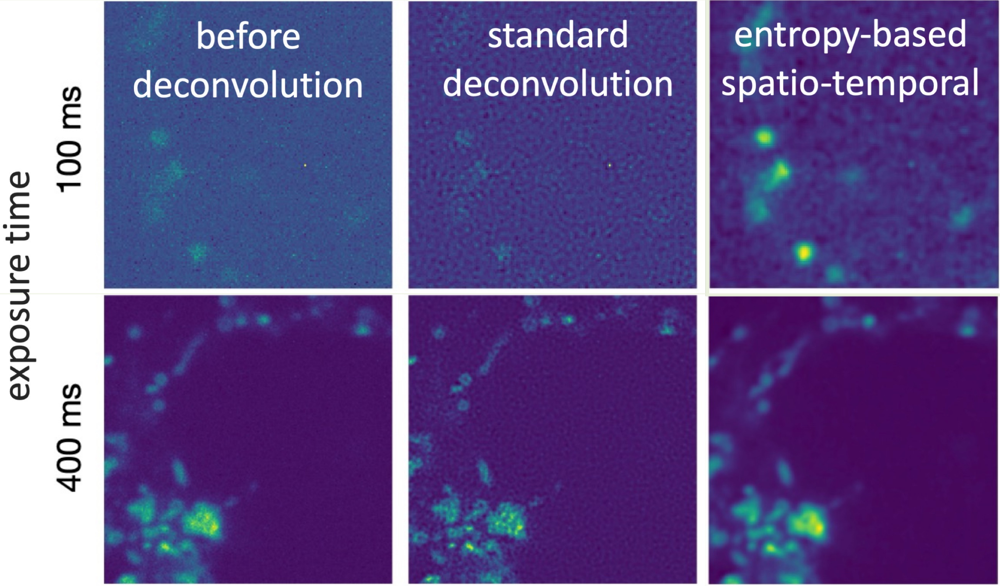

# Deconvolution

{: .note-title }
> General information

If the illumination time is increased when trying to generate high-resolution images of experimental data, 
undesirable side effects may occur: Live cells can cause motion artifacts, and rapid intensity fluctuations might 
not be captured. At the same time, longer exposure can lead to photobleaching and phototoxicity.
Too short an exposure time, however, can result in noisy images. 
This is where deconvolution comes in to equalize images, reduce noise, and increase resolution.

{: .note-title }
> Background information

When images are captured, various physical factors such as lenses and light incidence can cause
the original "ground truth" image to change. This effect is known as "convolution." Deconvolution aims to reverse this
process. It is based on the assumption that a real point of light (can be understood as a pixel in this case) 
has effects on neighboring points (or pixels) when the image is captured. 
This relationship is called the "point spread function" or "PSF", and Deconvolution attempts to reverse the effects
of this PSF. Using Deconvolution, images with short exposure time (and thus orignally poorer image quality) can still
produce data with high image quality, without the negative effects of longer light exposure.

{: .note-title }
> Lucy-Richardson Deconvolution

A commonly used method is the "Lucy-Richardson deconvolution" (LR) (Richardson WH, "Bayesian-Based Iterative Method
of Image Restoration",doi:10.1364/JOSA.62.000055, and Lucy LB, "An iterative technique for the rectification of 
observed distributions", doi:10.1086/111605), which was originally
developed in astronomy for star and planet images. 
It uses iterative steps in combination with PSF to produce realistic results.
LR is often considered a starting point against which newer methods are compared. 
However, it can lead to artifacts at edge transitions and poor results when the Signal-to-Noise Ratio (SNR) is low.

{: .note-title }
> Timedependent Entropy Deconvolution

An alternative approach is Timedependent Entropy Deconvolution (TDE) by Woelk et al. (https://pubmed.ncbi.nlm.nih.gov/34769223/).
This method captures temporal components as well as spatial components, which is particularly 
advantageous for video data. The biggest advantage of TDE is its ability to process
highly noisy images with low SNR -  Where LR deconvolution might produce poor results,
TDE can separate and recover the signal from noise. 
However, smoothing effects may occur at high intensity levels.

{: .note-title }
> Parameters for Deconvolution

{: .highlight }
>General Parameters for PSF calculation:
>- type: Type of the used microscope; "confocal" or "widefield"
>- lambdaEx_ch1: Excitation wavelength of the first channel (in nm)
>- lambdaEm_ch1: Emission wavelength of the first channel (in nm)
>- lambdaEx_ch2: Excitation wavelength of the second channel (in nm)
>- lambdaEm_ch2: Emission wavelength of the first channel (in nm)
>- numAper: Numerical Aperture of the objective 
>- magObj: Magnification of the objective
>- rindexObj: Refractive index of the immersion Medium
>- rindexSp: Refractive index of the specimen medium
>- ccdSize: Pixel dimension of the CCD (in the plane of the camera)

{: .highlight }
>Additional Parameters for TDE: 
>- lambda:  Spatial Lagrange parameter to weigh the regularization terms; needs to be determined empirically and can be widely 
> different dependent on the type of data; normally in the range of 0.1 to 3
>- lambda t: Temporal Lagrange parameter to weigh the regularization terms; Works best when of a similar order of magnitude as lambda

{: .note-title }
> Example 
> 
> _Comparison of deconvolution methods for TPC2-
> R.GECO.1.2 images captured with different 
> exposure times; Standard deconvolution corresponds to LR._ 

{: .important }
>In summary, deconvolution is based on the idea of correcting the effects of lenses and other optical factors on images. Different methods such as Lucy-Richardson deconvolution and timedependent entropy deconvolution are used to achieve image deconvolution, noise reduction, and resolution enhancement, with each method having its advantages and disadvantages.
