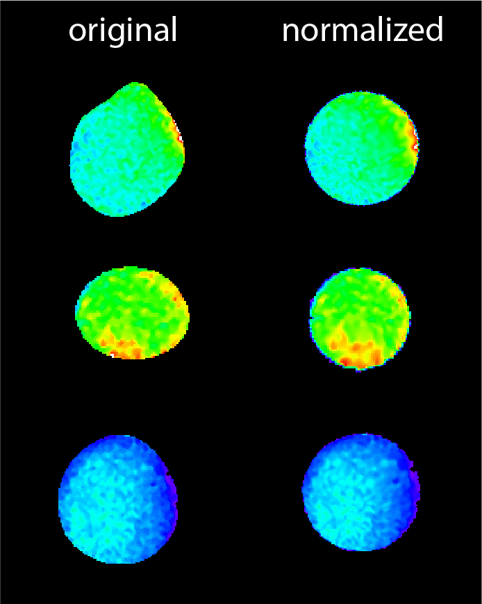

# Shape Normalization
## About

This part of the program takes a cell of arbitrary (reasonably convex) shape and returns the same cell normalized onto 
a circle, making it easier to compare and analyse multiple cells of different shapes.

Crucial for this step is the correct segmentation of the cell outline, 
since this determines the transformation.

Our implementation was inspired by the approach used by [Möhl et. al 2012](https://doi.org/10.1242/jcs.090746).

## Usage

The shape normalization takes as input image data containing a single cell. 
Neccessary information for the normalization:
1. the edge around the cell as a list of discrete points (x,y)
2. the coordinates of the cell centroid (x,y)
If this information is not supplied, the function will try to segment the cell using the StarDist algorithm.

The algorithm is purely two dimensional, time-dependent input will be processed frame-by-frame.

## Background

The normalization process can be described in three parts:

1. converting the edge coordinates from cartesian to polar coordinates $(r, \theta)$
2. normalizing the radii from the edge coordinates onto a fixed value, thus transforming the shape into a circle
3. interpolating the transformation of the edge onto the entire image using nearest neighbor interpolation